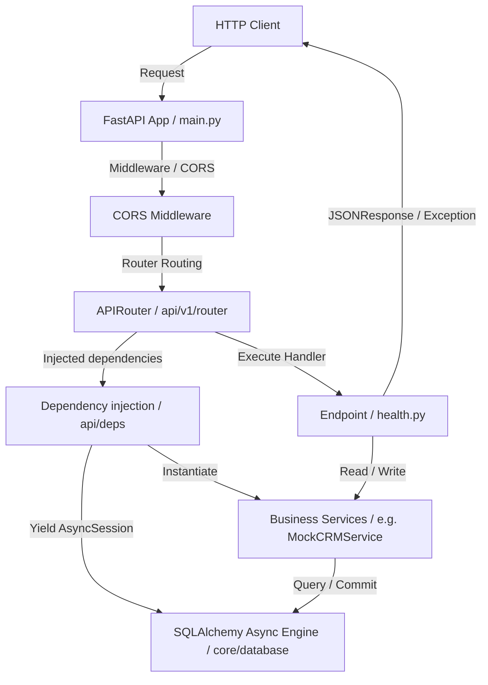

# Colour Labs Photographer CRM - Backend Foundation

Welcome to the backend foundation for the Colour Labs Photographer CRM. This project is built using Python 3.13 and FastAPI, adhering to clean architecture principles to ensure testability, scalability, and maintainability.

---

## 🏗️ Architecture Overview

The codebase is organized into layers that segregate concerns: settings validation, routing, business services, and database schemas.



---

## 📂 File & Folder Structure Walkthrough

### Directory Layout

- **`app/`**: Contains all source code for the application.
  - **`api/`**: Network-facing interfaces. Contains dependencies (`deps.py`) and API routers.
    - **`v1/`**: Subfolder for version 1 API routing (`router.py`) and endpoint handlers.
      - **`endpoints/`**: Files mapping API operations to path functions (e.g., `health.py`).
  - **`core/`**: Cross-cutting, configuration-related, and database utilities that are separate from business logic.
    - `config.py`: Configuration schemas using Pydantic Settings.
    - `database.py`: SQLAlchemy asynchronous connection pooling and ORM base model.
    - `exceptions.py`: Custom HTTP/domain exception hierarchy and global error handlers.
    - `logging.py`: Structured logging configuration (JSON format for container environments).
  - `main.py`: The root FastAPI declaration and lifespan lifecycle coordinator.
- **`alembic/`**: Contains database migration configurations and history tracking files.
  - `env.py`: Script that initializes the Alembic migration context.
  - `script.py.mako`: Template used to generate new migration files.
  - `versions/`: Directory storing generated database revision files.
- **Root Configurations**:
  - `alembic.ini`: Configuration file for Alembic settings.
  - `.env` & `.env.example`: Secret credential storage and templates.
  - `Dockerfile`: Production-ready, secure, multi-stage runner configuration.
  - `docker-compose.yml`: Multi-container orchestrator linking the API and PostgreSQL.
  - `requirements.txt`: Pin list of package dependencies.

---

## ⚙️ Core Concept Explanations

### 1. Request Lifecycle in FastAPI

When an HTTP client initiates a request (e.g., `GET /api/v1/health`), the following lifecycle occurs:
1. **Server Reception**: Uvicorn passes the HTTP socket streams to the FastAPI application instance.
2. **Lifespan Context Check**: The pre-request hooks run at startup. During request reception, the app is already listening.
3. **Middleware Pipeline**: The request flows through registered middlewares. The CORS middleware validates the `Origin` header against the whitelist in `settings.BACKEND_CORS_ORIGINS`.
4. **Routing & Parameter Extraction**: FastAPI checks the path in `/api/v1/router.py` and extracts parameters.
5. **Dependency Injection Resolution**:
   - FastAPI parses dependencies declared with `Depends(...)`.
   - It executes `get_db()`, which opens a transaction session via the async engine.
   - It passes that session to `get_crm_service()`, which instantiates a service.
6. **Controller Execution**: The path function `check_health` is executed, receiving the injected services.
7. **Response Serialization**: The return data (dictionaries or Pydantic models) is converted into JSON formats.
8. **Exception Interception**: If an error is raised (e.g. `SQLAlchemyError` or `AppException`), the global handlers inside `app/core/exceptions.py` format a standardized JSON payload and override the response.
9. **Dependency Cleanup**: The `get_db` generator completes execution, closing the database connection. The finalized HTTP response is sent back to the client.

### 2. Dependency Injection (DI)

FastAPI features a first-class dependency injection engine. We use it to:
- **Inject Database Sessions**: Yielding `AsyncSession` ensures database connections are safely closed after request fulfillment.
- **Perform Service Decoupling**: Rather than endpoints initializing services directly, FastAPI injects them (e.g., `MockCRMService`).
- **Simplify Testing**: During automated testing, we can override dependencies with mock services using `app.dependency_overrides`.

Example flow of chained dependency:
```
[Endpoint Handler]
       |
       v (Depends on service)
[MockCRMService]
       |
       v (Depends on database)
[AsyncSession (get_db)]
```

### 3. SQLAlchemy 2.0 Async ORM

We configure SQLAlchemy with the modern 2.0 standard:
- **Async Execution**: We use `create_async_engine` and `async_sessionmaker` utilizing the `asyncpg` driver. This prevents blocking I/O calls on the main ASGI event loop when querying the database.
- **Declarative Base**: All tables inherit from a unified `Base` class derived from `DeclarativeBase` rather than the old legacy `declarative_base()`.
- **Pool Tuning**: The engine is configured with `pool_size` and `max_overflow` to support concurrent traffic loads.

### 4. Alembic Database Migrations

Alembic tracks version revisions of database tables:
- **No Hardcoded Passwords**: Instead of storing the database URL in the plaintext `alembic.ini` file, our custom `alembic/env.py` overrides the connection string dynamically using `settings.ASYNC_DATABASE_URI`.
- **Async Support**: It runs on the async loop using `run_async_migrations()`, ensuring connection pool compliance.
- **Autogenerate**: By passing `Base.metadata` as the target metadata, Alembic automatically checks model changes against current database states when creating migrations.

### 5. Docker Containers & Isolation

Containerizing our services guarantees environment consistency:
- **Multi-Stage Build**: The `Dockerfile` separates compiling dependency wheels (stage 1) from the final run environment (stage 2). This keeps the final runner image thin (~150MB) and secure.
- **Security-First Execution**: The web application runs under `appuser` (a non-root context) to minimize damage if the web process is compromised.
- **Multi-Container Orchestration**: `docker-compose.yml` configures PostgreSQL and FastAPI to boot on an isolated network. The FastAPI container uses a database health check hook to wait until PostgreSQL is ready.

### 6. Scalability & Code Maintenance

This codebase is structured to scale effortlessly:
- **Horizontal Scaling**: By keeping the FastAPI application stateless and loading all states from PostgreSQL, we can spin up multiple replicas behind a load balancer.
- **Separation of Concerns**: Core logging, global exception schemas, settings management, and API routes are strictly decoupled. You can modify core settings without altering route business logic.
- **Standardized Error Handling**: Centralized handlers ensure clients receive uniform API structures, facilitating frontend integration and debugging.
